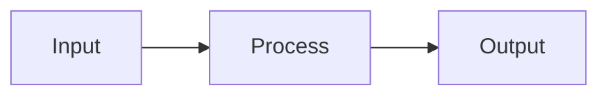
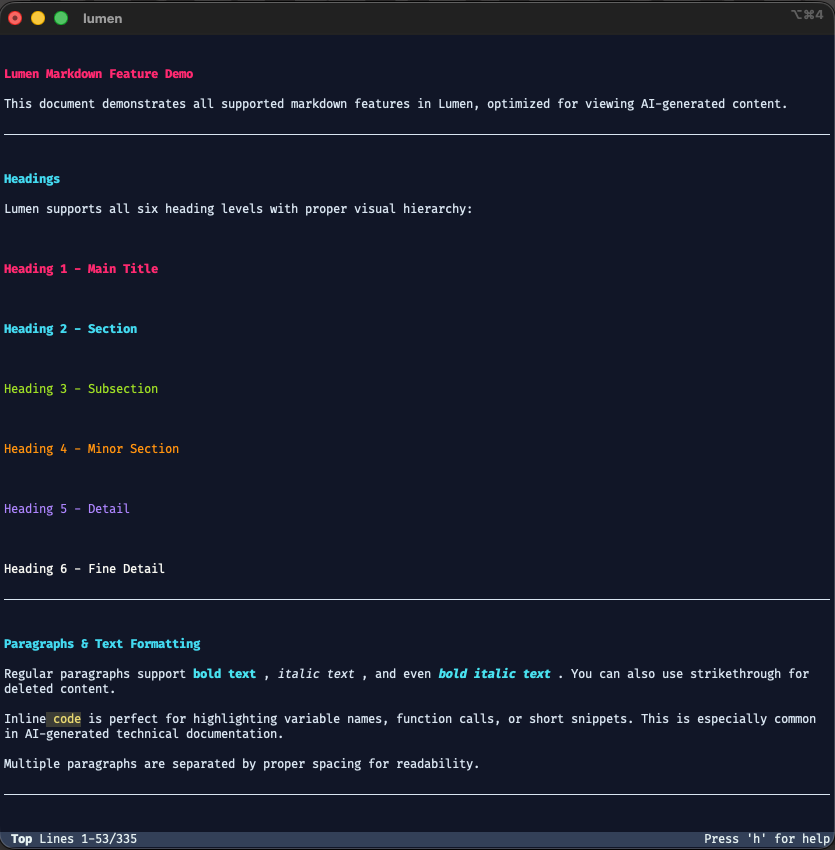
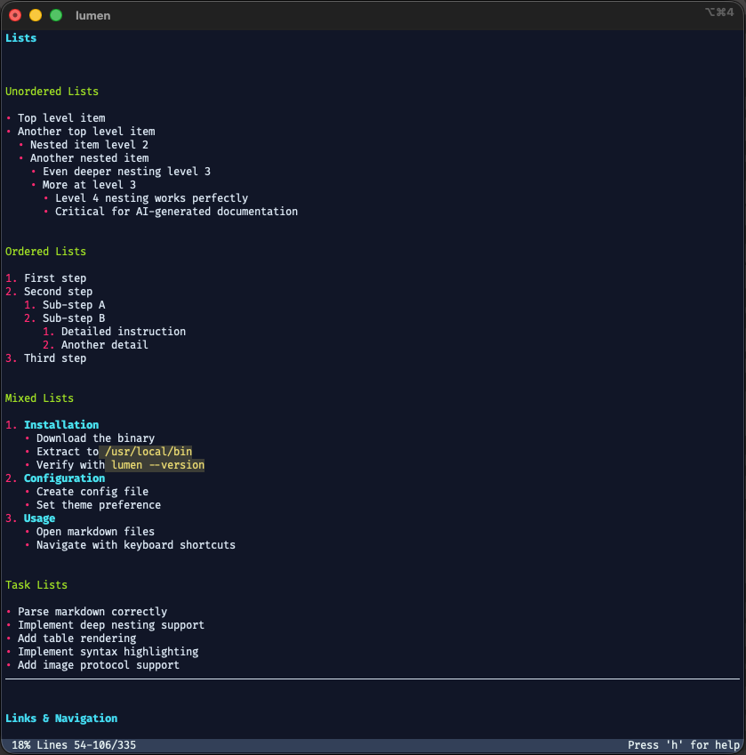
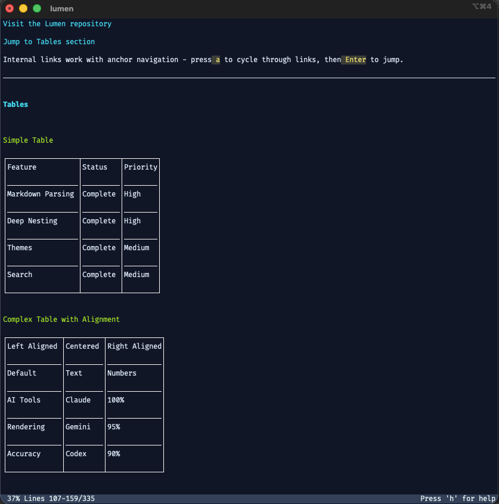
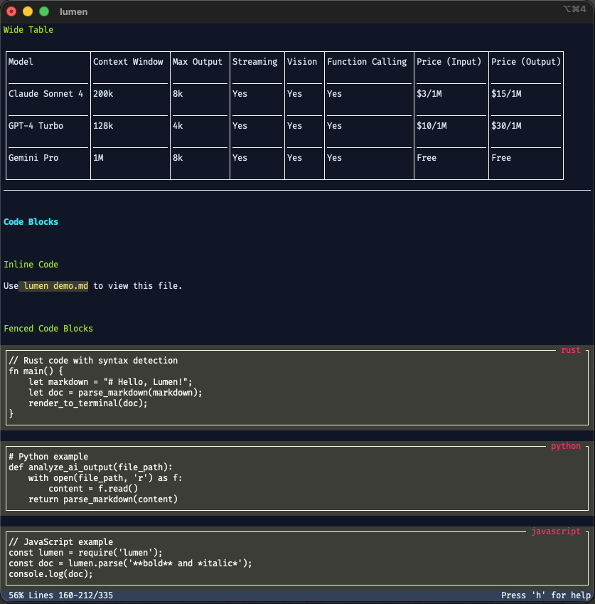
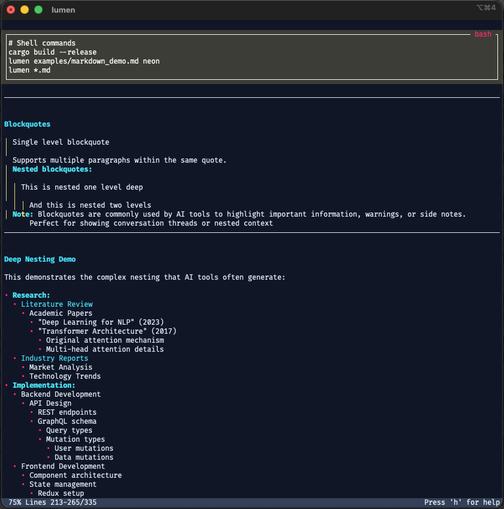
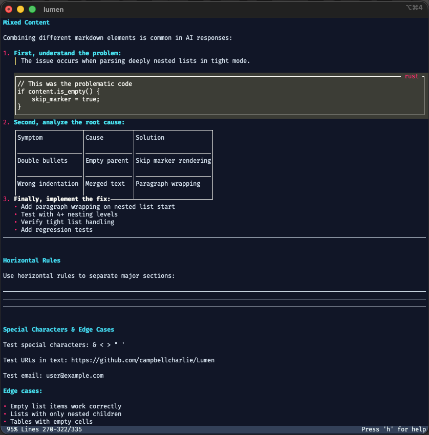
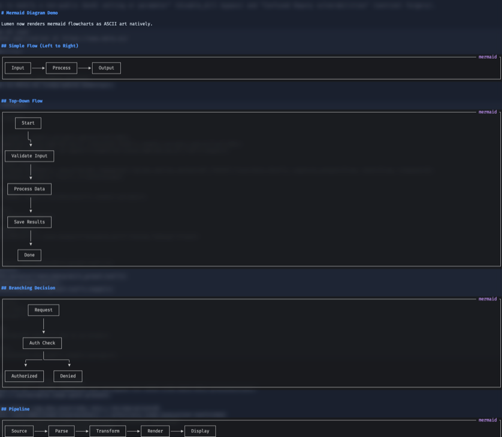
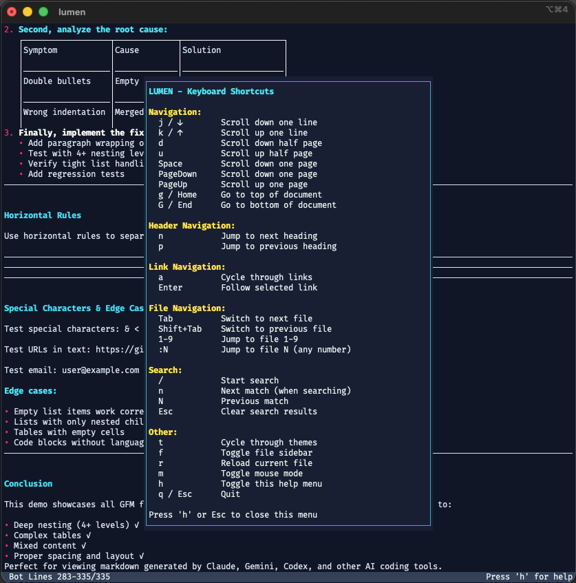

# Lumen

**A browser-like Markdown document renderer for modern terminals**

Lumen renders Markdown documents with rich layout, theming, and smooth scrolling—directly in your terminal. Built specifically for viewing markdown files generated by AI coding tools like Claude, Gemini, and Codex.

Unlike traditional Markdown viewers that style text with ANSI codes, Lumen treats rendering as a proper layout problem: Markdown → IR → Layout → Render. This approach handles complex nested structures, tables, and deeply nested lists that AI tools commonly generate.

---

## Installation

```bash
# Build and install
cargo build --release
cp target/release/lumen ~/.bin/  # or wherever you keep binaries

# Or use the install script (macOS)
./install-local.sh
```

## Usage

```bash
# View a single file
lumen README.md

# View multiple files (Tab to switch between them)
lumen claude_response.md gemini_output.md codex_analysis.md

# Use a different theme
lumen README.md neon

# View with inline images
lumen README.md --inline-images

# Disable images
lumen README.md --no-images

# List all available themes (built-in + user)
lumen --list-themes

# Import a vim colorscheme as a Lumen theme
lumen --import-theme https://github.com/morhetz/gruvbox
lumen --import-theme https://vimcolorschemes.com/NLKNguyen/papercolor-theme
lumen --import-theme ./colors/mytheme.vim --name mytheme
```

---

## Themes

### Built-in Themes

- `docs` — Clean, documentation-focused (default)
- `neon` — Vibrant, modern with bright colors
- `minimal` — Low visual noise, ASCII fallbacks
- `dracula` — Dark purple with vibrant accents
- `monokai` — Classic Sublime Text inspired
- `solarized` — Low-contrast, easy on the eyes
- `gruvbox` — Retro groove with warm colors
- `nord` — Arctic, blue-ish coldness
- `tokyo-night` — Modern dark Tokyo-inspired
- `catppuccin` — Soothing pastel colors

Press `t` while viewing to cycle through all themes.

### User Themes

Drop YAML theme files in `~/.lumen/themes/` and they'll be available alongside built-in themes. User themes are included in the `t` cycle and shown in `--list-themes`.

### Importing Vim Colorschemes

Import any vim colorscheme from GitHub, [vimcolorschemes.com](https://vimcolorschemes.com), or a local `.vim` file:

```bash
# From a GitHub repo
lumen --import-theme https://github.com/dracula/vim

# From vimcolorschemes.com
lumen --import-theme https://vimcolorschemes.com/NLKNguyen/papercolor-theme

# From a direct .vim file URL
lumen --import-theme https://raw.githubusercontent.com/joshdick/onedark.vim/main/colors/onedark.vim --name onedark

# From a local file
lumen --import-theme ./colors/mytheme.vim
```

Imported themes are saved to `~/.lumen/themes/` and immediately usable.

---

## Mermaid Diagrams

Lumen renders mermaid flowchart code blocks as ASCII/Unicode art directly in the terminal — no external tools needed.

````markdown

````

Renders as:

```
┌─────────┐     ┌───────────┐     ┌──────────┐
│  Input  │────▶│  Process  │────▶│  Output  │
└─────────┘     └───────────┘     └──────────┘
```

Supports `graph` and `flowchart` with all directions (LR, RL, TD/TB, BT), node shapes, edge labels, and branching. Unsupported diagram types (sequence, class, etc.) display as raw code.

Inspired by [mermaid-ascii](https://github.com/AlexanderGrooff/mermaid-ascii) by Alexander Grooff.

---

## Keyboard Shortcuts

### Navigation
| Key | Action |
|-----|--------|
| `j` / `↓` | Scroll down one line |
| `k` / `↑` | Scroll up one line |
| `d` | Scroll down half page |
| `u` | Scroll up half page |
| `Space` / `PageDown` | Scroll down one page |
| `PageUp` | Scroll up one page |
| `g` / `Home` | Go to top of document |
| `G` / `End` | Go to bottom of document |
| `n` | Next heading (or next search result) |
| `p` | Previous heading |
| `N` | Previous search result |

### Search
| Key | Action |
|-----|--------|
| `/` | Start search |
| `Enter` | Execute search / close search input |
| `n` / `N` | Next / previous match |
| `Esc` | Clear search results |

### Links & Anchors
| Key | Action |
|-----|--------|
| `a` | Cycle through links |
| `Enter` | Follow selected link (jump to anchor) |

### File Management
| Key | Action |
|-----|--------|
| `Tab` | Switch to next file |
| `Shift+Tab` | Switch to previous file |
| `1`-`9` | Jump to file by number |
| `:` then number | Jump to file N (e.g., `:12`) |
| `f` | Toggle file sidebar |
| `r` | Reload current file |

### General
| Key | Action |
|-----|--------|
| `t` | Cycle through themes |
| `m` | Toggle mouse mode |
| `h` | Toggle help menu |
| `q` / `Esc` | Quit |

---

## Why Lumen?

AI coding tools (Claude, Gemini, Codex) generate complex markdown with deep nesting, large tables, and mixed content that traditional viewers struggle with:

- **Deep nested lists**: AI responses often have 4+ levels of nesting - Lumen handles them correctly
- **Large tables**: Data comparisons and feature matrices render with accurate borders
- **Mixed content**: Code blocks, tables, and lists intermixed without layout issues
- **Navigation**: Jump through table of contents links, cycle between multiple response files
- **Readable**: Proper spacing, wrapping, and visual hierarchy unlike raw terminal markdown

---

## Screenshots

### Headings & Text Formatting


### Lists & Tasks


### Links & Tables


### Wide Tables & Code Blocks


### Blockquotes & Deep Nesting


### Mixed Content


### Mermaid Diagrams


### Help Menu


---

## Features

### Markdown Support
- Full GFM (GitHub Flavored Markdown) support
- Headings, paragraphs, lists (including deep nesting 4+ levels)
- Tables with accurate border rendering
- Code blocks, task lists, strikethrough
- Links, images, blockquotes with nesting
- Mermaid flowchart diagrams rendered as ASCII art
- Proper tight list handling for correct structure

### Theming
- 10 built-in themes with `t` to cycle
- User themes from `~/.lumen/themes/` (YAML)
- Import vim colorschemes from GitHub or vimcolorschemes.com
- Color palettes with RGB/ANSI fallbacks
- Multiple border styles: Single, Double, Rounded, Heavy, ASCII
- Theme validation with automatic spacing clamping

### Layout & Rendering
- Vertical flow layout with proper margins
- Smart text wrapping with Unicode display-width awareness (CJK, emoji)
- Table layout with column distribution
- Rich colors (24-bit RGB, 256-color, 16-color)
- Box-drawing characters for borders
- Double-buffered rendering for smooth scrolling

### Interactive Navigation
- Keyboard-driven navigation (vim-style bindings)
- Full-text search with match highlighting
- Link cycling and anchor jumping for table of contents
- Multi-file support with tab switching and file sidebar
- Theme cycling with status bar notification
- Mouse support (scroll, click links)
- File reload without restart

---

## Architecture

Lumen uses a multi-stage rendering pipeline:

```
Markdown → IR (pulldown-cmark) → Theme + Layout → Terminal Renderer (Ratatui)
```

**Key design decisions:**
- Stable IR prevents downstream churn when parser changes
- Token-based theming (no CSS selectors, just element-type styling)
- Two-phase layout: measure intrinsic sizes, then assign positions
- Character-grid coordinates for natural terminal rendering
- Unicode-width aware throughout (correct display for CJK, emoji)

---

## Project Structure

```
Lumen/
├── src/
│   ├── ir/           # Intermediate representation
│   ├── parser/       # Markdown → IR
│   ├── theme/        # Theming system + vim import
│   ├── layout/       # Layout engine
│   ├── render/       # Terminal renderer
│   ├── mermaid.rs    # Mermaid diagram ASCII renderer
│   ├── search.rs     # Full-text search
│   ├── preferences.rs # User preferences
│   ├── file_manager.rs # Multi-file management
│   ├── lib.rs        # Public API
│   └── main.rs       # Interactive viewer binary
├── themes/           # YAML theme files
├── examples/         # Demo programs and sample markdown
└── install-local.sh  # Local install script
```

---

## Dependencies

- [pulldown-cmark](https://github.com/pulldown-cmark/pulldown-cmark) — Fast, spec-compliant Markdown parser
- [Ratatui](https://github.com/ratatui/ratatui) — Terminal UI framework
- [crossterm](https://github.com/crossterm-rs/crossterm) — Cross-platform terminal manipulation
- [unicode-width](https://github.com/unicode-rs/unicode-width) — Correct display width for Unicode
- [ureq](https://github.com/algesten/ureq) — Lightweight HTTP client (for theme downloads)

---

## Development

### Running Tests

```bash
cargo test
```

### Examples

```bash
# Mermaid diagram demo
lumen examples/mermaid_demo.md

# Theme demo
cargo run --example themes

# Layout demo
cargo run --example layout
```

---

## License

MIT
