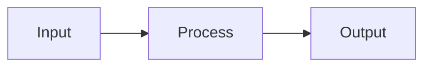
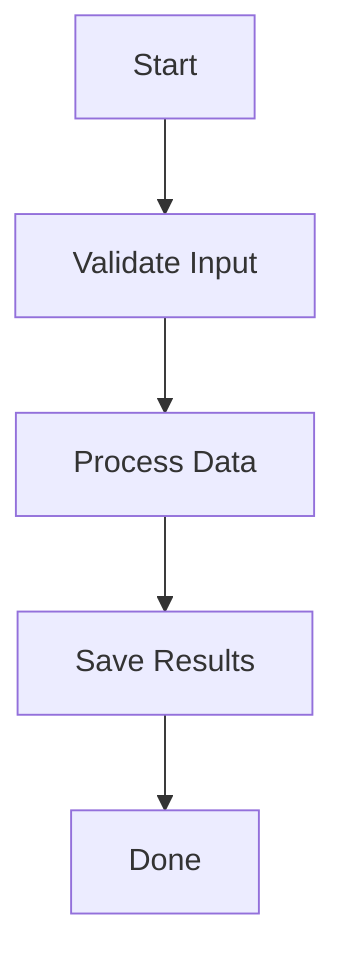
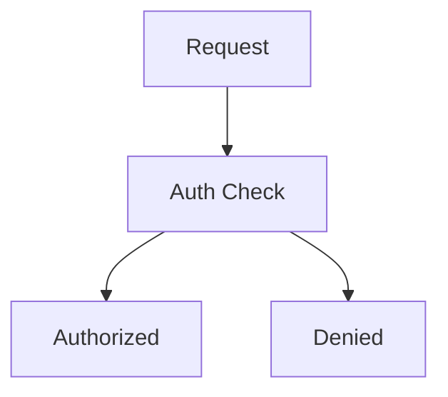
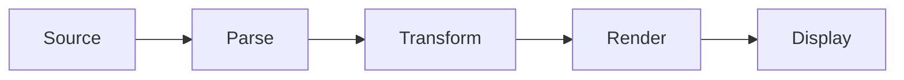
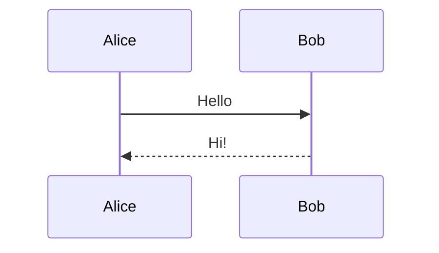

# Mermaid Diagram Demo

Lumen now renders mermaid flowcharts as ASCII art natively.

## Simple Flow (Left to Right)



## Top-Down Flow



## Branching Decision



## Pipeline



## Non-mermaid code blocks still render normally

```python
def hello():
    print("This is regular code, not mermaid")
```

## Unsupported diagram types show raw code


